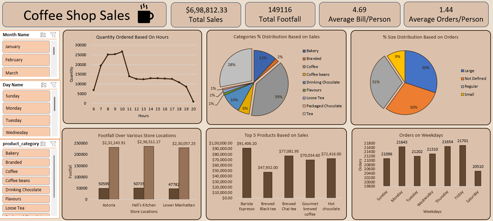

# Coffee Shop Sales Analysis Dashboard  
---
## 📌 Table of Contents
- <a href="#Project-Overview">Project Overview</a>
- <a href="#Tools-Used>">Tools Used</a>
- <a href="#Project-Structure">Project Structure</a>
- <a href="#Business-Questions-Solved">Business Questions Solved</a>
- <a href="#Key-Insights">Key Insights</a>
- <a href="#Dashboard-Preview">Dashboard Preview</a>
- <a href="#Project-Structure">Project Structure</a>
- <a href="#How-to-Use">How to Use</a>
- <a href="#Result-&-Conclusion">Result & Conclusion</a>
- <a href="#Author--Contact">Author & Contact</a>

---
<h2><a class =”anchor” id=”Project-Overview”></a>Project Overview</h2> 
 
This project analyzes sales data from a Coffee Shop (dataset from Maven Analytics) to uncover trends in revenue, customer behavior, and product performance.    
The goal was to transform raw transactional data using Excel (Power Query & Pivot Tables) and design an interactive dashboard for business insights.

---

<h2><a class =”anchor” id=”Tools-Used”></a>Tools Used</h2> 

-  Microsoft Excel (Power Query, Pivot Tables, Charts, Slicers)
-  Dataset: [Maven Analytics - Coffee Shop Sales] (https://mavenanalytics.io/data-playground)

---  
<h2><a class =”anchor” id=”Business-Questions-Solved”></a>Business Questions Solved</h2> 
 
- How do sales vary by **day of the week** and **hour of the day**?  
- Are there any **peak times** for sales activity?  
- What is the **total sales revenue per month**?  
- How do sales vary across **different store locations**?  
- What is the **average order value per person**?  
- Which products are the **best-selling** in terms of **quantity and revenue**?  
- How do sales vary across **product categories and product types**?  


---  
<h2><a class =”anchor” id=”Key-Insights”></a>Key Insights</h2>

- **Peak Hours:** Highest sales between **8 AM – 10 AM**, aligned with morning coffee rush.  
- **Day-wise Trends:** Fridays & Saturdays generated **15–20% higher sales** compared to weekdays.  
- **Store Revenue:** Downtown location consistently outperformed others by **25%+**.  
- **Average Order Value:** ~$4.50 per customer.  
- **Best-Selling Products:** Coffee drinks made up **60% of sales volume**, while pastries contributed the **highest revenue margin**.  
- **Category Analysis:** Hot Coffee was the most ordered product type, but Seasonal Drinks had the **highest revenue per item**.  

---
<h2><a class =”anchor” id=”Dashboard-Preview”></a>Dashboard Preview</h2>

  

---
<h2><a class =”anchor” id=”Project-Structure”></a>Project Structure</h2>

```
coffee-shop-sales/
├─ README.md
├─ LICENSE
├─ .gitignore
├─ data/
│   ├─ sample_data.csv
│   └─ README.md
├─ excel/
│   └─ coffee_shop_dashboard.xlsx
├─ visuals/
│   ├─ dashboard_overview.png
│   ├─ sales_by_day.png
│   ├─ product_performance.png
│   └─ store_revenue.png

```
---
<h2><a class =”anchor” id=”How to Use”></a>How to Use</h2>

1. Download the repo.  
2. Open `excel/coffee_shop_dashboard.xlsx`.  
3. Use slicers to filter by **date, store location, and product category**.  
4. Explore interactive visuals & KPIs.  

---
<h2><a class =”anchor” id=”Result & Conclusion”></a>Result & Conclusion</h2>

- Peak sales observed during morning hours (8–11 AM), especially on weekdays, indicating strong coffee demand during office hours.  
- Saturday recorded the highest sales volume, showing weekend rush patterns.
- The Downtown store consistently outperformed other locations in terms of revenue.
- Brewed Coffee and Espresso emerged as top products in both quantity and revenue, highlighting customer preference for core coffee products.
- Insights suggest focusing on morning promotions, loyalty programs for weekdays, and expanding popular product categories to maximize revenue.

---
<h2><a class =”anchor” id=”Author & Contact”></a>Author & Contact</h2>

- Author: Ashutosh Arekar
- Email: ashutosharekar02@gmail.com
- LinkedIn: https://www.linkedin.com/in/ashutosh-arekar-a837a2319/
- GitHub: https://github.com/Ashutosharekar

---
